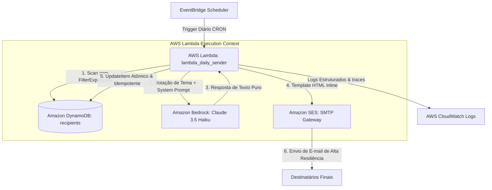

# ✝️ Mensageiro Bíblico Generativo

### **Arquitetura Cloud-Native Serverless de Orquestração GenAI na AWS**

<p align="center">
  
</p>

<p align="center">
  
  
  
  
  
</p>

---

## 🛠️ Visão Geral da Solução

O **Mensageiro Bíblico Generativo** é uma solução de engenharia de software corporativa, baseada no paradigma **Cloud-Native** e **100% Serverless**, projetada sob uma arquitetura orientada a eventos (*Event-Driven*). O objetivo principal do ecossistema é automatizar de forma resiliente a orquestração de Grandes Modelos de Linguagem (LLMs) na nuvem pública AWS. 

A arquitetura foi minuciosamente projetada para operar sob demanda (modelo *Pay-Per-Use*), mantendo os custos operacionais fixos em **zero** e enquadrando-se inteiramente na categoria de elegibilidade da **AWS Free Tier**. O sistema varre bases NoSQL de destinatários ativos, aciona modelos de fundação generativa por meio do **Amazon Bedrock**, renderiza interfaces HTML responsivas inline e distribui e-mails em lote com controle rígido de concorrência, idempotência e tratamento transacional de erros.

---

## 📐 Arquitetura do Sistema e Fluxo de Dados E2E

O ecossistema divide-se em componentes fracamente acoplados, orquestrados de ponta a ponta sem estado persistente em disco (stateless), maximizando a escalabilidade e a tolerância a falhas.



### ⚙️ Fluxo Operacional Detalhado
1. **Ativação Cronométrica**: O **Amazon EventBridge Scheduler** dispara um gatilho de forma agendada no início do dia, invocando o container da AWS Lambda.
2. **Coleta Eficiente de Destinatários**: A Lambda executa um método de leitura otimizado na tabela **Amazon DynamoDB**, aplicando uma expressão de filtragem no nível de servidor para coletar exclusivamente registros que contêm a chave `ativo = true`.
3. **Orquestração GenAI Serverless**: A Lambda determina o dia da semana atual e seleciona o tema teológico rotativo. Ela despacha o *System Prompt* estruturado juntamente com o tema para o **Amazon Bedrock**, invocando o **Anthropic Claude 3.5 Haiku** em milissegundos.
4. **Acoplamento e Renderização de UI**: O payload retornado pelo modelo é acoplado a um template de e-mail responsivo em HTML estrito contendo folha de estilos CSS embutida em linha (*inline CSS*).
5. **Transmissão Resiliente em Lote**: A Lambda realiza o processamento individual em laço (*loop*). Cada e-mail é despachado via **Amazon SES**.
6. **Persistência Transacional de Status**: O status da transação de entrega (`ENVIADO` ou `ERRO:codigo`) e o `MessageId` do SES são imediatamente gravados no DynamoDB de forma atômica para fins de auditoria e controle de idempotência.

---

## 🧠 Orquestração de LLMs e Engenharia de Prompt

Para contornar falhas clássicas de IA Generativa, como alucinação de citações ou formatações inconsistentes, a aplicação emprega estratégias avançadas de controle operacional.

### 📝 Estrutura do System Prompt (`config.py`)
O modelo de fundação Claude 3.5 Haiku é condicionado sob um contexto de comportamento determinístico:
```python
SYSTEM_PROMPT = """Você é um assistente espiritual cristão.
Sua tarefa é gerar uma mensagem bíblica diária inspiradora.
A mensagem deve conter:
1. Um versículo bíblico completo (livro, capítulo e versículo)
2. Uma reflexão curta (3 a 5 linhas) sobre o versículo
3. Uma oração de encerramento (2 a 3 linhas)
Escreva em português brasileiro. Seja acolhedor, positivo e edificante.
Não use markdown. Use apenas texto simples com quebras de linha."""
```

### 🔄 Técnica de Rotação Teológica por Dia da Semana
Evitando a monotonia e o desgaste de conteúdo repetitivo, a Lambda determina dinamicamente o tema do prompt com base no índice do dia corrente da semana (`datetime.now().weekday()`), implementando um dicionário de rotação indexado em nível de módulo:
*   `0`: Fé | `1`: Esperança | `2`: Amor | `3`: Perdão | `4`: Força | `5`: Paz | `6`: Gratidão.

### 📧 Renderização Responsiva de E-mail
O texto gerado pelo modelo é inserido em um invólucro de formatação robusto com quebras de linha preservadas (`white-space: pre-wrap;`) e containers responsivos limitados a `600px` de largura máxima, garantindo legibilidade absoluta em clientes legados como Outlook e modernos como Gmail e Apple Mail.

---

## 🛡️ Persistência NoSQL, Tratamento de Falhas e IAM

### 🚀 Otimizações no DynamoDB
1. **Redução de RCU (Read Capacity Units)**: Em vez de buscar todos os registros e filtrá-los em memória na Lambda, a consulta utiliza uma expressão de filtro nativa da AWS:
   ```python
   resposta = tabela.scan(FilterExpression=Attr('ativo').eq(True))
   ```
   Isso reduz significativamente a quantidade de dados transmitidos e minimiza o consumo de banda de I/O de rede.
2. **Atualizações Atômicas Condicionais**: O status e metadados de envio são injetados no banco de dados usando expressões de atualização atômicas (`update_item`), garantindo que apenas os atributos pertinentes sejam alterados, reduzindo o tráfego de gravação e evitando conflitos de concorrência:
   ```python
   tabela.update_item(
       Key={'email': destinatario['email']},
       UpdateExpression='SET ultimo_envio = :data, ultimo_status = :status, ultimo_message_id = :mid',
       ExpressionAttributeValues={
           ':data':   datetime.now().isoformat(),
           ':status': status,
           ':mid':    message_id
       }
   )
   ```

### 🛡️ Padrão de Resiliência a Falhas em Lote
O processamento de e-mails em lote é encapsulado por um mecanismo isolador de erros (*Error Isolation boundary*). Se uma chamada falhar devido a rejeições de domínio no SES, chaves inválidas ou exaustão de cota de envio:
- A exceção `ClientError` da `botocore` é isolada no escopo do destinatário atual.
- O status de falha (`ERRO:codigo_erro`) é registrado no DynamoDB.
- A Lambda continua a execução para os próximos e-mails do lote de forma ininterrupta, prevenindo falhas em cascata no ecossistema de produção.

### 🔐 Segurança Baseada no Princípio de Menor Privilégio (IAM Policy)
O projeto define e utiliza uma política baseada em IAM de alta granularidade (detalhada em `infrastructure/iam-policy.json`), evitando o uso de privilégios globais (`*`). O acesso a recursos cruciais é restrito a ARNs e ações específicas de API:

```json
{
  "Version": "2012-10-17",
  "Statement": [
    {
      "Sid": "BedrockInvoke",
      "Effect": "Allow",
      "Action": ["bedrock:InvokeModel", "bedrock:Converse"],
      "Resource": "arn:aws:bedrock:us-east-1::foundation-model/anthropic.claude-3-5-haiku-*"
    },
    {
      "Sid": "DynamoDBAccess",
      "Effect": "Allow",
      "Action": ["dynamodb:Scan", "dynamodb:UpdateItem"],
      "Resource": "arn:aws:dynamodb:us-east-1:ACCOUNT_ID:table/biblical-recipients"
    },
    {
      "Sid": "SESendEmail",
      "Effect": "Allow",
      "Action": ["ses:SendEmail"],
      "Resource": "*"
    }
  ]
}
```

---

## 🏛️ Estrutura do Repositório Mapeada

A arquitetura do diretório segue padrões estruturais limpos e rigorosos, dividindo escopos de aplicação, testes e automação de IaC:

```
aws-biblical-messenger/
├── docs/                             ← Documentações complementares e diagramas
│   ├── apresentacao.pptx
│   ├── documentacao_v2.docx
│   ├── manual_daily_message.docx
│   └── img/                          ← Assets e identidades visuais do projeto
├── infrastructure/                   ← Infraestrutura como Código (IaC) e Automação
│   ├── cloudformation.yaml           ← Template declarativo AWS CloudFormation
│   ├── deploy.sh                     ← Pipeline simplificado bash de empacotamento e deploy
│   ├── dynamodb-schema.json          ← Estrutura do Schema de tabelas do DynamoDB
│   ├── eventbridge-schedule.json     ← Definições do Cron EventBridge
│   └── iam-policy.json               ← Definição de permissões IAM granulares
├── src/                              ← Código-fonte da aplicação
│   ├── lambda_daily_sender/          ← Serviço Lambda de processamento diário
│   │   ├── lambda_function.py        ← Handler central de envio
│   │   ├── config.py                 ← System Prompt, Rotação e Model ID
│   │   └── requirements.txt          ← Dependências de produção
│   └── lambda_api_generator/         ← Serviço Lambda gerador sob demanda via REST
│       ├── generate_message.py       ← Handler de geração via API Gateway
│       ├── client.py                 ← Cliente demonstrativo para requisições HTTP
│       └── requirements.txt          
├── tests/                            ← Arquitetura de Testes Automatizados
│   ├── requirements-test.txt         
│   ├── test_daily_sender.py          ← Testes unitários focados na Lambda diária
│   └── test_api_generator.py         ← Testes unitários focados na API de geração
├── .env.example                      
├── .gitignore                        ← Proteção contra vazamento de credenciais locais
└── README.md
```

---

## 🧪 Estrutura de Testes Automatizados e Mocking com Moto v5

A garantia de qualidade e comportamento do código é fornecida por uma suíte robusta de testes utilizando **Pytest** e **Moto (v5)**, o framework de simulação oficial para emulação de infraestruturas AWS locais na memória.

### 🔌 Isolamento Total de Dependências
Para contornar o problema de instanciação global do `boto3` que gera erros de credenciais não encontradas fora de contextos de execução, a suíte injeta dinamicamente chaves de acesso dummy no ecossistema do interpretador antes de inicializar os handlers das Lambdas:
```python
import os
os.environ['AWS_ACCESS_KEY_ID'] = 'testing'
os.environ['AWS_SECRET_ACCESS_KEY'] = 'testing'
os.environ['AWS_SECURITY_TOKEN'] = 'testing'
os.environ['AWS_SESSION_TOKEN'] = 'testing'
os.environ['AWS_DEFAULT_REGION'] = 'us-east-1'
os.environ['DYNAMODB_TABLE'] = 'biblical-recipients'
os.environ['SES_SENDER'] = 'test@example.com'
```

### 🏆 Testando com Decoradores Moto Unificados (`@mock_aws`)
Utilizando a versão moderna Moto 5.x, emulamos de forma integrada o banco NoSQL e o sistema de mensagens SES sem bater em rede externa:
*   Criação em memória de tabelas DynamoDB com chaves primárias.
*   Injeção de payloads de destinatários ativos e inativos para validação do `FilterExpression`.
*   Simulação de chamadas com e sem sucesso para aferição da tolerância de falhas.

### 🏃 Executando a Suíte de Testes
```bash
# Entre na pasta de testes
cd tests

# Instale as dependências exclusivas de testes
pip install -r requirements-test.txt

# Execute a suíte de forma verbosa
pytest -v
```

---

## 🚀 Como Executar e Implantar o Projeto

### 1. Configuração do Ambiente Local
Crie as credenciais da AWS em sua máquina de desenvolvimento local:
```bash
aws configure
```

### 2. Configurações de Variáveis no Ambiente AWS (Lambda)
Defina as seguintes variáveis sob o ambiente de execução da AWS Lambda para guiar a lógica central da aplicação:
*   `MODEL_ID`: `anthropic.claude-3-5-haiku-20241022-v1:0`
*   `SES_SENDER`: O e-mail configurado e verificado no console AWS SES.
*   `DYNAMODB_TABLE`: `biblical-recipients`

### 3. Deploy Automatizado
O script `deploy.sh` localizado em `infrastructure/` provê um pipeline automatizado simplificado. Ele cria as pastas temporárias de build, instala as dependências declaradas em `requirements.txt`, cria um pacote compactado em formato zip limpo contendo apenas o escopo de produção e atualiza de forma atômica o código-fonte da AWS Lambda associada no console da AWS:
```bash
# Dê permissões de execução
chmod +x infrastructure/deploy.sh

# Execute o deploy
./infrastructure/deploy.sh
```

---

<!-- Início da seção "Contato" -->
<h2>🌐 Contate-me </h2>
<div>
  <p>Developed by <b>Fábio Nogueira</b></p>
</div>
<p>
<a href="https://www.linkedin.com/in/faanogueira/" target="_blank"></a>
<a href="https://github.com/faanogueira" target="_blank"></a>
<a href="https://api.whatsapp.com/send?phone=5571983937557" target="_blank"></a>
<a href="https://fabio-nogueira.vercel.app" target="_blank"></a> 
<a href="mailto:faanogueira@gmail.com"></a> 
</p>
<!-- Fim da seção "Contato" -->
